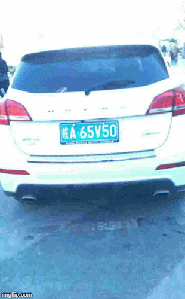
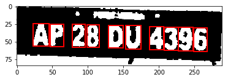

# Number Plate Detection System

This project aims to detect vehicles entering the campus of IIT Roorkee, recording the Number Plates for security purposes. The system tracks the vehicle and separates the number plate from the automobile and outputs the digits. This system has been implemented with a number of approaches and a lot of work is still needed to refine the whole pipeline. In this repo we are using Deep Learning techniques like YOLO for object detection and have also implemented OCR (using openCV).

# Requirements
- [PyTorch](https://pytorch.org/) 
- [OpenCV](https://opencv.org/)

# Sample Frames being Processed For Output


# In a Nutshell
In a nutshell here is how this project works
- In the directory `vehicle-detection`, on executing `final.py` with the video taken as an input, it is converted into snapshots,  which is followed by Object Detection using `YoloNet` which outputs the bounding boxes for the vehicles from these frames. The frame with the vehicle in the output are are saved in the directory `vehicle-detection/output`.

#### Steps to Run

Clone the repository:
```sh
git clone https://github.com/dsgiitr/np_detection.git
```

Run the command:
```sh
python final.py
```

#### The sample snapshot of detected Vehicle Can be seen below


- In the `palate_localization` directory we used a CNN For Palate Localization. The trained model has been saved as `model.pth` and can be accessed in the directory. 

The dataset can be found from this google drive link for directly downloading the whole dataset: [Dataset 12GB](https://drive.google.com/open?id=1fFqCXjhk7vE9yLklpJurEwP9vdLZmrJd). To train the model again, place the data in `palate_localization/photos` folder.

#### Dataset Annotations

Annotations are embedded in file name.

A sample image name is "025-95_113-154&383_386&473-386&473_177&454_154&383_363&402-0_0_22_27_27_33_16-37-15.jpg". Each name can be splited into seven fields. Those fields are explained as follows.

- **Area**: Area ratio of license plate area to the entire picture area.

- **Tilt degree**: Horizontal tilt degree and vertical tilt degree.

- **Bounding box coordinates**: The coordinates of the left-up and the right-bottom vertices.

- **Four vertices locations**: The exact (x, y) coordinates of the four vertices of LP in the whole image. These coordinates start from the right-bottom vertex.

- **License plate number**: Each image in CCPD has only one LP. Each LP number is comprised of a Chinese character, a letter, and five letters or numbers. A valid Chinese license plate consists of seven characters: province (1 character), alphabets (1 character), alphabets+digits (5 characters). "0_0_22_27_27_33_16" is the index of each character. These three arrays are defined as follows. The last character of each array is letter O rather than a digit 0. We use O as a sign of "no character" because there is no O in Chinese license plate characters.
```
provinces = ["皖", "沪", "津", "渝", "冀", "晋", "蒙", "辽", "吉", "黑", "苏", "浙", "京", "闽", "赣", "鲁", "豫", "鄂", "湘", "粤", "桂", "琼", "川", "贵", "云", "藏", "陕", "甘", "青", "宁", "新", "警", "学", "O"]
alphabets = ['A', 'B', 'C', 'D', 'E', 'F', 'G', 'H', 'J', 'K', 'L', 'M', 'N', 'P', 'Q', 'R', 'S', 'T', 'U', 'V', 'W',
             'X', 'Y', 'Z', 'O']
ads = ['A', 'B', 'C', 'D', 'E', 'F', 'G', 'H', 'J', 'K', 'L', 'M', 'N', 'P', 'Q', 'R', 'S', 'T', 'U', 'V', 'W', 'X',
       'Y', 'Z', '0', '1', '2', '3', '4', '5', '6', '7', '8', '9', 'O']
```

- **Brightness**: The brightness of the license plate region.

- **Blurriness**: The Blurriness of the license plate region.

#### Execute the command after placing the train data to start training

```sh
python train.py
```

The Model used can bee seen in the file `model.py`.
```python
        self.features = nn.Sequential(
            hidden1,
            hidden2,
            hidden3,
            hidden4,
            hidden5,
            hidden6,
            hidden7,
            hidden8,
            hidden9,
            hidden10
        )
        self.classifier = nn.Sequential(
            nn.Linear(63360, 100),
            # nn.ReLU(inplace=True),
            nn.Linear(100, 100),
            # nn.ReLU(inplace=True),
            nn.Linear(100, 12),
        )
```
#### open terminal in directory and run the command below to see te working of palate Localization
```sh
python predict.py
```
#### The sample of the localized plate can be seen below:


- In the `predictCharacter` directory we implement the character predictor from scratch using `OpenCv`. To run the character predictor place the sample in the directory `predictorCharacter/output`  with the name `frame-1` and open terminal here to run the `PredictCharacters.py`.

#### The sample of output from the `predictCharacter` can be seen below



#### To run the entire project at once just run the file `initialize.py`

```sh
python initialize.py
```

Note: CUDA is compulsory to run the above network.

# Future Work

This work is in the very elementry stage and we'd like to improve upon the following:

* Making the system autonomous on live videos and increasing the robustness of the system overall.
* Deploying the same into production with a complete backend database.
* Tackling more than one vehicle in the frame.
* Tackling obstruction of Number Plate Detector with not so important text on the vehicle like the car name or any kind of text that the model may find in the frame and output instead of the number plate.

# Contributing
Any kind of enhancement or contribution is welcomed.

# Acknowledgement
